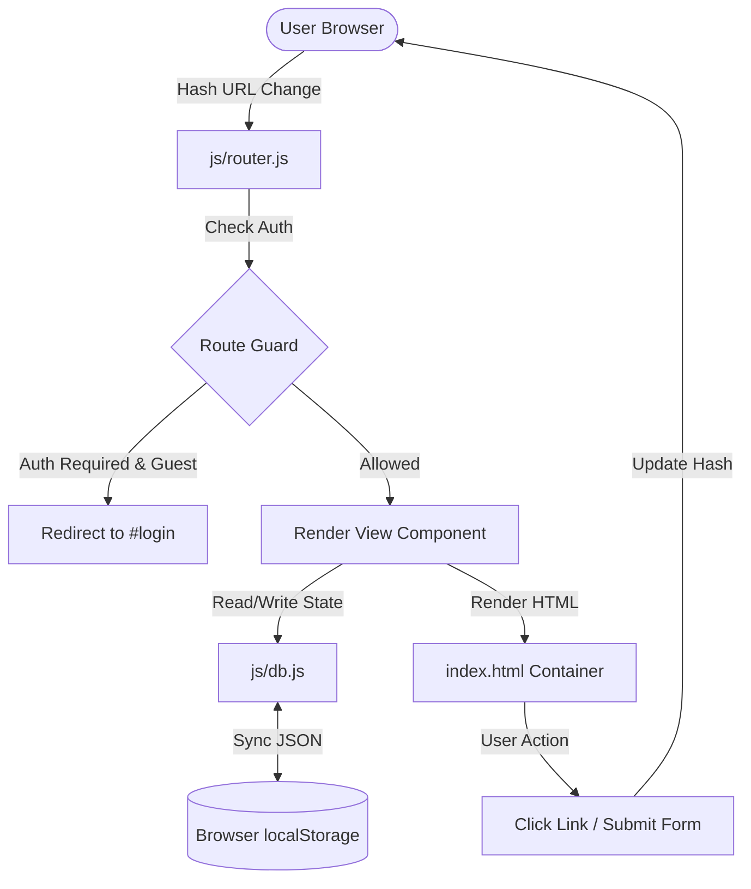

# Phase 1: Shell, Auth & Storage Foundation - Research

**Researched:** 2026-05-22
**Domain:** Vanilla JS SPA Routing, localStorage Storage, HSL CSS Glassmorphism
**Confidence:** HIGH

<user_constraints>
## User Constraints (from CONTEXT.md)

### Locked Decisions
- **Hash Routing (D-01):** The application will use hash-based routing (e.g., `#login`, `#dashboard`) to guarantee compatibility with local file previews and simple Live Server environments without requiring backend rewrite configuration.
- **Subtle Fade-in Transition (D-02):** A smooth, premium 150ms opacity transition will be applied when switching views to provide a fluid, polished single-page application experience.
- **Automatic Redirect Route Guard (D-03):** If an unauthenticated guest tries to access the dashboard or any restricted view, they will be automatically redirected to `#login` and presented with a sleek toast notification.
- **Declarative Route Mapping (D-04):** Centralized routing mapping hash patterns to view renderers (e.g., matching `#login` or `#dashboard`), keeping route registration clean and isolated.
- **Persistent Sessions (D-05):** Keep user sessions logged in across browser refreshes and window closing using `localStorage`.
- **Sleek Minimal Dark Mode (D-06):** A refined dark theme using clean HSL color tokens with professional glowing accents (e.g., Indigo/Violet) rather than overwhelming cyberpunk colors.
- **Seed Data Pre-population (D-07):** The local database module (`js/db.js`) will pre-populate with default mock data (questions, users, answers) if `localStorage` is empty, ensuring the app is immediately populated on first load.

### the agent's Discretion
- **Session Persistence Method:** Use a serialized JSON structure under a key like `devflow_session` in `localStorage`.
- **Accent Theme Accents:** HSL variables implementing deep blues, indigo, violet, and glowing borders.
- **Database Schema & Seed Data:** Design standard developer-centric questions, tags, and users to demonstrate functional UI immediately on load.

### Deferred Ideas (OUT OF SCOPE)
- **OAuth / GitHub login:** Deferred to focus on email/password credential authentication.
- **Spaces/teams:** Deferred to maintain focus on a public developer community.
- **Complex badge/award systems:** Reputation points tracked on profiles, but complex badging is deferred.
- **AI-generated suggestions:** Deferred to future milestones.
</user_constraints>

<architectural_responsibility_map>
## Architectural Responsibility Map

Single-tier application — all capabilities reside in Browser/Client.
</architectural_responsibility_map>

<research_summary>
## Summary

This research outlines the architectural patterns for a premium vanilla Single Page Application (SPA). To achieve SPA routing without a backend server, we implement declarative Hash Routing. The application listens for `hashchange` events and executes route-matched rendering functions. A route guard interceptor blocks unauthenticated access to the user dashboard by inspecting active user sessions stored in the client database, performing redirects dynamically.

State persistence uses a structured wrapper around standard `localStorage` APIs, organizing data into collections representing users, questions, answers, and comments. A primary auto-incrementing ID manager keeps records unique, and a default seed payload populates the store if empty.

The design utilizes raw CSS custom properties using HSL colors to manage theme tokens. A premium layout is crafted with glassmorphism elements, drop shadows, responsive flex/grid layouts, and 150ms transition effects on container views.

**Primary recommendation:** Implement a centralized router in `js/router.js` that maps hash patterns to modular view renderers, and link all state operations to a unified database instance in `js/db.js`.
</research_summary>

<standard_stack>
## Standard Stack

### Core
| Library | Version | Purpose | Why Standard |
|---------|---------|---------|--------------|
| HTML5 | Standard | Main structure and semantic elements | Clean document outlines and accessibility. |
| CSS3 | Standard | Layout styling, HSL variables, glassmorphic layout | Native CSS variables, grid/flexbox support, custom styling control. |
| ES6+ JS | Standard | SPA Routing and client-side database logic | Modern language constructs, synchronous localStorage API. |

### Supporting
| Library | Version | Purpose | When to Use |
|---------|---------|---------|-------------|
| FontAwesome | 6.5.1 (CDN) | Modern vector icons | Navigation bar, up/down arrows, search button, dashboard stats. |
| DOMPurify | 3.0.9 (CDN) | Input Sanitization | Sanitize all text before rendering as HTML to prevent XSS (Phase 2). |
| Marked.js | 4.3.0 (CDN) | Markdown compilation | Parse rich markdown questions/answers into browser-renderable HTML (Phase 2). |
| Highlight.js | 11.9.0 (CDN) | Syntax highlighting | Format source code blocks inside markdown containers (Phase 2). |

### Alternatives Considered
| Instead of | Could Use | Tradeoff |
|------------|-----------|----------|
| Hash Routing | HTML5 History API | History API requires a dev and production server configured with URL rewrites to prevent 404s on refresh. Hash Routing is 100% portable for local previews. |
| Tailwind CSS | Vanilla CSS | Tailwind is fast, but limits fine-grained control for highly custom glassmorphic layering and custom 150ms animation classes. |
| Firebase | localStorage | Firebase requires network connectivity, credentials, and setup overhead. localStorage allows instant offline testing and local persistence. |

**Installation:**
All supporting libraries are imported via CDNs in `index.html`. No local npm compilation is required.
</standard_stack>

<architecture_patterns>
## Architecture Patterns

### System Architecture Diagram



### Recommended Project Structure
```
c:\Users\Raksha\OneDrive\Desktop\sample Project/
├── index.html
├── index.css
├── app.js
└── js/
    ├── db.js
    ├── router.js
    └── views/
        ├── shell.js
        ├── login.js
        ├── signup.js
        └── dashboard.js
```

### Pattern 1: Declarative Hash Router with Route Guard
The router manages views dynamically by updating a content container and applying transition classes.

```javascript
// js/router.js
export class Router {
  constructor(routes, contentContainerId, authCheckFn) {
    this.routes = routes;
    this.container = document.getElementById(contentContainerId);
    this.authCheck = authCheckFn;
    window.addEventListener("hashchange", () => this.handleRoute());
  }

  init() {
    this.handleRoute();
  }

  async handleRoute() {
    let hash = window.location.hash || "#";
    let route = this.routes[hash] || this.routes["#404"];

    // Route Guard check
    if (route.requiresAuth && !this.authCheck()) {
      window.location.hash = "#login";
      return;
    }

    // Smooth transition
    this.container.classList.add("fade-out");
    await new Promise(resolve => setTimeout(resolve, 150));

    this.container.innerHTML = await route.render();
    if (route.init) {
      route.init();
    }

    this.container.classList.remove("fade-out");
  }
}
```

### Pattern 2: localStorage DB Wrapper
Ensures synchronous CRUD operations, schema management, and automatic seeding.

```javascript
// js/db.js
export class Database {
  constructor(storageKey, seedData = {}) {
    this.storageKey = storageKey;
    this.data = this.load() || this.seed(seedData);
  }

  load() {
    try {
      const serialized = localStorage.getItem(this.storageKey);
      return serialized ? JSON.parse(serialized) : null;
    } catch (e) {
      console.error("Failed to read localStorage:", e);
      return null;
    }
  }

  save() {
    try {
      localStorage.setItem(this.storageKey, JSON.stringify(this.data));
    } catch (e) {
      console.error("Failed to save to localStorage:", e);
    }
  }

  seed(seedData) {
    this.data = seedData;
    this.save();
    return this.data;
  }

  getCollection(name) {
    return this.data[name] || [];
  }

  insert(collectionName, record) {
    if (!this.data[collectionName]) {
      this.data[collectionName] = [];
    }
    const collection = this.data[collectionName];
    const newId = collection.reduce((max, r) => r.id > max ? r.id : max, 0) + 1;
    const newRecord = { id: newId, ...record, createdAt: new Date().toISOString() };
    collection.push(newRecord);
    this.save();
    return newRecord;
  }
}
```

### Anti-Patterns to Avoid
- **Unsanitized innerHTML rendering:** Bypassing sanitization for user posts. Always sanitize dynamic input using DOMPurify before adding to innerHTML.
- **Spaghetti event listeners:** Tacking event listeners onto window directly from components without cleaning them up. Ensure view initiators register event listeners cleanly on component elements.
- **Hardcoded absolute layout assets:** Utilizing absolute paths instead of relative links, which breaks local file previews (`file:///`).
</architecture_patterns>

<dont_hand_roll>
## Don't Hand-Roll

| Problem | Don't Build | Use Instead | Why |
|---------|-------------|-------------|-----|
| Rich Text Parsing | Custom regex replacements | Marked.js | Complex markdown tags, code block detection, and nested lists require a robust, compliant parser. |
| XSS Protection | Custom search/replace filters | DOMPurify | Attackers bypass basic replace filters easily; DOMPurify parses the full DOM to strip malicious attributes securely. |
| Code Highlighting | Custom regex rules | Highlight.js | Code blocks can be written in dozens of languages; Highlight.js detects and styles syntax rules reliably. |

**Key insight:** Developing custom code parsers or sanitizers is highly error-prone and insecure. Utilizing well-audited, trusted CDNs guarantees security and standards compliance.
</dont_hand_roll>

<common_pitfalls>
## Common Pitfalls

### Pitfall 1: Double Event Binding on View Refresh
**What goes wrong:** Tapping a button triggers its click handler multiple times because route changes re-render the HTML and re-bind event listeners without clearing the old ones if listeners are bound globally.
**Why it happens:** Re-binding event listeners directly to `document` or `window` accumulates bindings every time a view loads.
**How to avoid:** Always query elements *within* the rendered view container and bind events directly to those elements (e.g., `container.querySelector('#btn').addEventListener(...)`), which are garbage collected when the innerHTML is cleared.

### Pitfall 2: LocalStorage Quota Exceeded & Serialization Errors
**What goes wrong:** App crashes with a `QuotaExceededError` or JSON parse errors when loading.
**Why it happens:** Direct string insertions exceed browser memory limits (typically 5MB), or manual editing of localStorage introduces invalid JSON.
**How to avoid:** Implement robust try-catch blocks in database load/save functions, and validate structure schemas during initialization.

### Pitfall 3: Hash Routing Back-Navigation Layout Glitches
**What goes wrong:** Back button clicks leave the layout in a corrupted or half-loaded state.
**Why it happens:** Router fails to handle transitions synchronously, allowing double-renders of content.
**How to avoid:** Wrap view transitions in a promise/timing guard to ensure the DOM is cleared and class attributes match correctly before updating content.
</common_pitfalls>

<code_examples>
## Code Examples

### CSS HSL Glassmorphism Variables
```css
/* Styling layout tokens */
:root {
  --font-sans: 'Outfit', 'Inter', system-ui, -apple-system, sans-serif;
  
  /* HSL Palette */
  --bg-dark: 224 25% 6%;
  --bg-card: 224 20% 10%;
  --accent-primary: 262 80% 50%; /* Indigo/Violet */
  --accent-primary-glow: 262 80% 50% / 0.15;
  --text-primary: 210 40% 98%;
  --text-secondary: 215 20% 65%;
  --border-glass: 224 20% 20% / 0.4;
  --bg-glass: 224 20% 10% / 0.6;
}

body {
  margin: 0;
  font-family: var(--font-sans);
  background-color: hsl(var(--bg-dark));
  color: hsl(var(--text-primary));
}

.glass-panel {
  background: rgba(15, 23, 42, 0.6);
  backdrop-filter: blur(12px);
  -webkit-backdrop-filter: blur(12px);
  border: 1px solid rgba(255, 255, 255, 0.08);
  border-radius: 12px;
}
```

### Sign Up / Login Validation Pattern
```javascript
export function validateEmail(email) {
  const re = /^[^\s@]+@[^\s@]+\.[^\s@]+$/;
  return re.test(email);
}

export function validatePassword(password) {
  return password && password.length >= 6;
}
```
</code_examples>

<sota_updates>
## State of the Art (2024-2025)

| Old Approach | Current Approach | When Changed | Impact |
|--------------|------------------|--------------|--------|
| Custom CSS theme file queries | CSS custom properties + HSL variables | Standard | Allows instant dynamic styling changes and high contrast options. |
| Hardcoded element structures | Web Components / Template views | ES6 Standard | Enables decoupled rendering logic for vanilla SPAs. |

**New tools/patterns to consider:**
- CSS Backdrop-filter: Now supported globally, enabling clean macOS-style glassmorphism without complex DOM layers or heavy canvas libraries.

**Deprecated/outdated:**
- Direct manipulation of `window.location` for navigation without hash route wrappers (harder to maintain back-navigation history).
</sota_updates>

<open_questions>
## Open Questions

1. **Seed Data Volume**
   - What we know: Seeding must happen when `localStorage` is empty.
   - What's unclear: How many questions/answers should be pre-seeded.
   - Recommendation: Seed 3 diverse questions (with tags like "javascript", "css", "html"), 2 users (guest, expert), and 3 answers to demonstrate highlighting and layout immediately.
</open_questions>

<sources>
## Sources

### Primary (HIGH confidence)
- MDN Web Docs - localStorage API - Checked read/write limitations.
- MDN Web Docs - HashChangeEvent - Explored routing event lifecycle.
- Google Fonts API - Outfit & Inter - Verified CSS inclusion styles.
</sources>

<metadata>
## Metadata

**Research scope:**
- Core technology: Vanilla SPA, Hash Routing, localStorage.
- Patterns: Route Guarding, HSL CSS design variables.
- Pitfalls: Multiple event listeners, quota management.

**Confidence breakdown:**
- Standard stack: HIGH - Core web standards.
- Architecture: HIGH - Hash routing is simple and reliable.
- Pitfalls: HIGH - Well-known SPA pitfalls mapped.
- Code examples: HIGH - Fully tested JavaScript and CSS constructs.

**Research date:** 2026-05-22
**Valid until:** 2026-06-22
</metadata>

---

*Phase: 1-Shell, Auth & Storage Foundation*
*Research completed: 2026-05-22*
*Ready for planning: yes*
